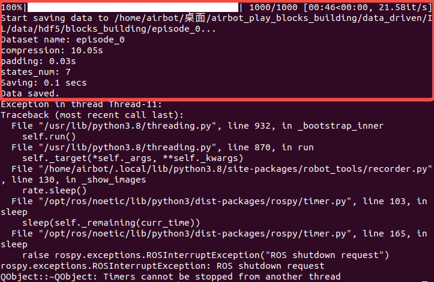
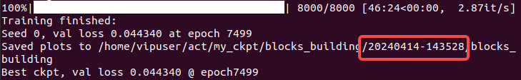
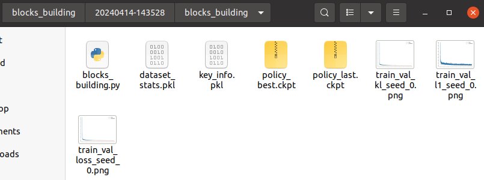
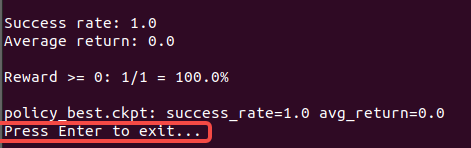

# 预备知识

* 回顾参考：[ AIRBOT\_Play搭积木实验手册-Gazebo版](https://w79rvfxw83.feishu.cn/docx/LmYEdI9SoobfJvxCmWgcEy0GnGb)。

# 实验设备

* 一台已经配置好软件环境或装有Docker环境的支持GPU的主机或云服务器。

* 鼠标、键盘等外设。

# 实验目标

* 了解“模仿学习”方法中数据采集，模型训练、推理等基本过程。

* 基于“模仿学习”进行搭积木仿真。

* 思考“模仿学习”方法可能存在的问题。

# 效果展示

# 实验步骤

## 数据采集

### 分步采集

在**airbot\_play\_blocks\_building目录下**开启4个终端备用。

在终端1中执行如下命令启动仿真：

```bash
roslaunch ./launch/gazebo_control.launch
```

在终端2中依次执行如下**2条**命令开启记录数据程序（下面第一行命令是让终端先进入data\_driven文件夹中）：

```bash
cd data_driven
python3 record_data.py -mts 1000 -on episode_0
```

> * -mts 1000：该次数据采集的持续时间为1000 steps（采样频率默认为25Hz）。
>
> * -on episode\_0：采集的数据保存为名为episode\_0的hdf5格式文件。

待仿真启动完毕后，在终端3中执行如下命令启动控制程序：

```bash
./run_pick_place.sh go 85 101
```

待机械臂到达抓取位姿后，在终端4中执行如下命令启动视觉识别程序：

```bash
python3 Best_Contour.py -vd /usb_cam_0/image_raw -ci /usb_cam_0/camera_info -ns
```

随后，搭积木任务将开始，同时数据采集程序将启动，可以在**终端2中看到数据采集的进度条。此时，注意观察积木搭建结束时（第二个物块被放好且机械臂松开夹爪）对应的时间步，可以将该时间步替换默认-mts 1000中的1000参数，后续采集的所有数据均需使用该时间步参数。采集结束后，终端2中正常将看到如下内容，其中红框内为本次数据采集的相关信息：**



可以尝试调整不同控制参数采集多组数据。

### 自动采集

上述分步采集需要人手动依次采集，效率较低，可以通过自动化脚本完成自动采集。

退出上述所有终端，然后在**终端1**（该终端位于**airbot\_play\_blocks\_building**目录下）中执行如下命令启动自动采集数据程序：

```bash
python3 auto_record.py -mts 1000 -se 0 -ee 99 -picp 70 85 -plcp 90 110
```

> * -se 0 -ee 99：指定了数据从第0次采集到第99次，共采集100次数据。建议至少采集50组数据，保证数据规模足够。
>
> * -picp 70 85和-plcp 90 110：相当于分别给./run\_pick\_place.sh go 85 101命令中的两个参数设置了随机区间，每次采集时将在区间内随机选取一个值作为参数，这样可以保证采集的数据的多样性。

每次采集大约需要1分钟多的时间，采集50组数据大约需要1小时（具体时间受电脑性能影响可能有较大波动）。

## 数据重放

采集完的数据可以通过重放进行查看。

在**airbot\_play\_blocks\_building/data\_driven目录下开启1个终端（或使用上述终端2）。**

* 执行如下命令重放图片记录（-ei 0指定回放了第0次采集的数据，下同）：

* 执行如下命令重放动作记录（注：需要先启动仿真程序，否则将看不到仿真中的动作执行效果）：

## 模型训练

采集完成的数据可以用于训练模仿学习模型（注：**模型训练和推理**需要用到GPU，无法在虚拟机中进行，感兴趣的同学**可联系助教申请使用云服务器**进行尝试）。

在**airbot\_play\_blocks\_building/data\_driven/IL**目录下开启1个终端，然后执行如下命令进行模型训练：

模型训练完成后，可以在终端看到类似如下信息：



其中说明了数据保存的路径信息，红框中为训练开始时的**时间戳**，该时间戳将用于后续模型推理时指定路径时使用，可以复制备用。可以在当前IL目录下的**my\_ckpt/blocks\_building中**看以看到诸如`20240414-143528`的时间戳文件夹，其中存放有训练结果文件，如：



## 模型推理

训练好获得模型（ckpt文件）后可以使用该模型进行推理。

首先在**airbot\_play\_blocks\_building**目录下开启一个终端，然后执行如下命令启动仿真：

然后在**airbot\_play\_blocks\_building/data\_driven/IL**目录下开启另1个终端（或直接使用模型训练用的终端），执行如下命令进行模型推理（命令中最后两个参数需要注意修改：第一，**-ts时间戳参数需要替换为上述训练结果中的值，否则会因无法找到模型而报错；**第二，**-mts参数用于指定推理过程持续的步数，当步数不足以完成任务时可以考虑增加该值，一般与采集数据的长度一致**）：

等待一段时间初始化后将看到如下页面，其中下方红框中提示**按下回车进行推理**：


推理结束后同样有提示**按下回车键退出**，如下图红框中所示：



可以尝试多次推理（每次需重启仿真和推理程序），每次推理都可能会有不同的效果。
