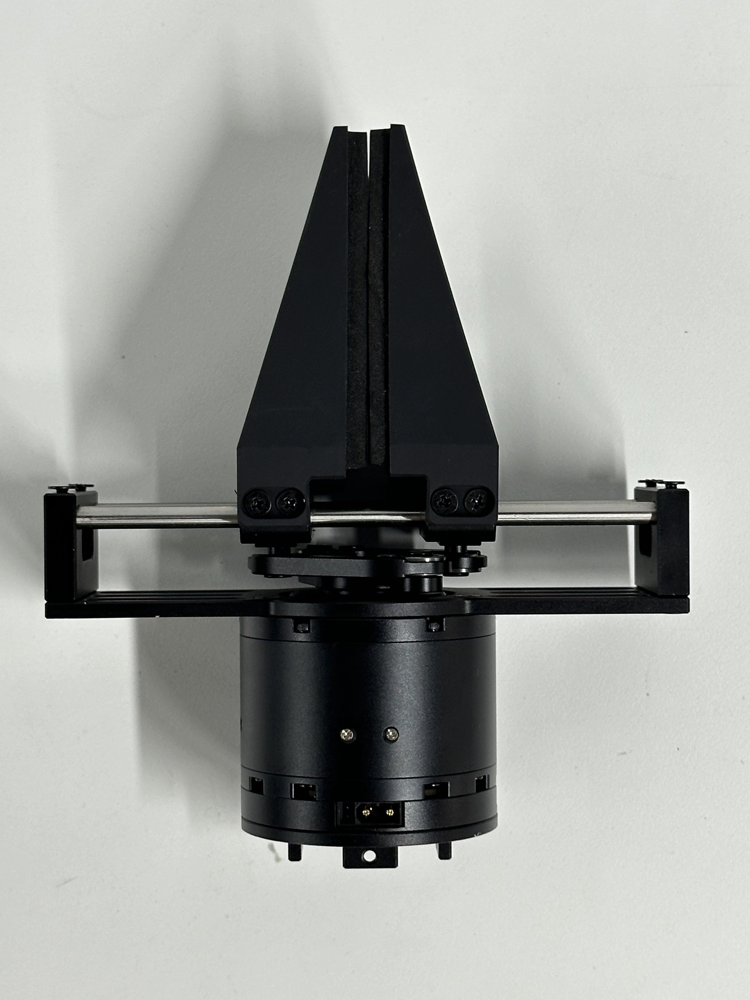
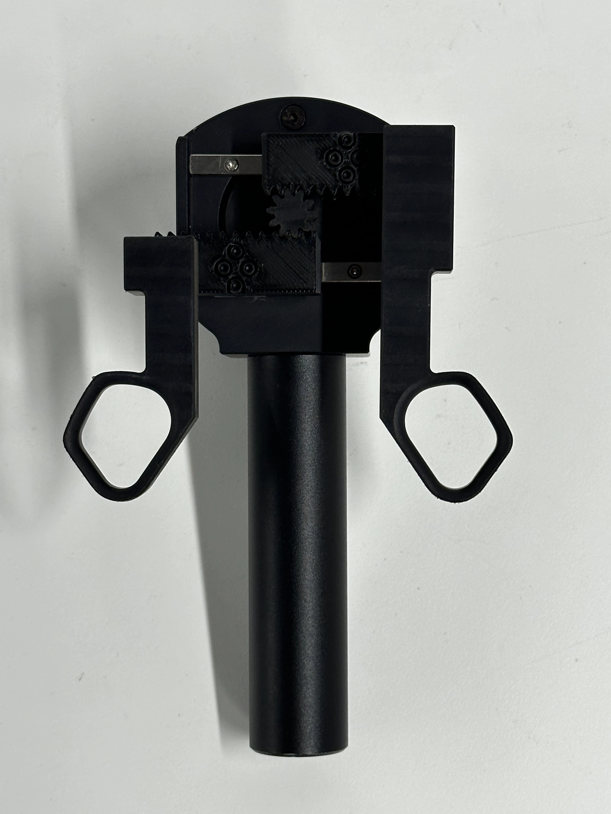
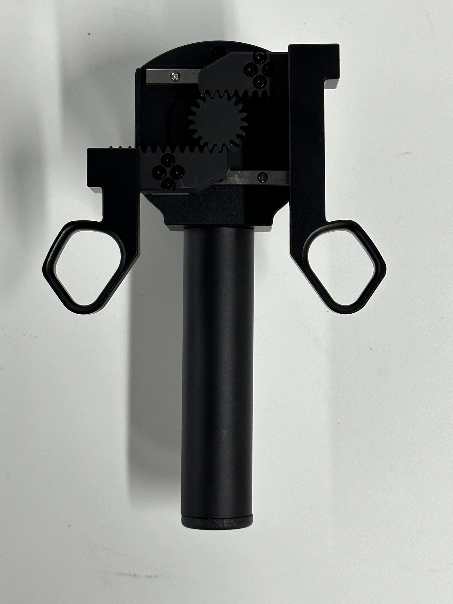

# 末端执行器

## 末端执行器更换方式

TBD

## 末端执行器支持清单

AIRBOT Play 支持多种末端执行器：

* `AIRBOT Gripper 2`: 二指夹爪，代号 `gripper`
* `AIRBOT Demonstrator 2`: 二指示教器，代号 `newteacher`
* `AIRBOT Demonstrator 2 (ver. 2)`: 二指示教器v2，代号 `teacherv2`

!!! question "区别"
    AIRBOT Demonstrator 2 和 AIRBOT Demonstrator 2 (ver. 2) 的区别在于，后者的齿轮半径更大，使用过程中更省力、更平滑。

## AIRBOT Gripper 2

-   

-   AIRBOT Gripper 2 是 AIRBOT Play 的标准末端执行器。它是一个二指夹爪，可以通过电机控制开合。

    在软件使用中，一般使用  <strong><code>gripper</code></strong> 指代 AIRBOT Gripper 2，如 `airbot_kbd_ctrl -e gripper` 表示使用键盘控制安装了 AIRBOT Gripper 2。详情请参考[软件使用说明](../tutorials/tools.md)。

## AIRBOT Demonstrator 2

-   

-   AIRBOT Demonstrator 2 是 AIRBOT Play 的示教器。它是一个带有开合机构的末端执行器，可以通过开合操控另一个二指夹爪的运动。

    在软件使用中，一般使用  <strong><code>newteacher</code></strong> 指代 AIRBOT Demonstrator 2，如 `airbot_sync --leader-end-mode newteacher` 表示在遥操作使用场景中，操作臂末端安装了 AIRBOT Demonstrator 2。详情请参考[软件使用说明](../tutorials/tools.md)。

## AIRBOT Demonstrator 2 (ver. 2)

-   

-   AIRBOT Demontstrator 2 (ver. 2) 是 AIRBOT Demonstrator 2 的升级版本。它在 AIRBOT Demonstrator 2 的基础上增加了一个夹爪，可以通过电机控制开合。

    在软件使用中，一般使用  <strong><code>teacherv2</code></strong> 指代 AIRBOT Demonstrator 2 (ver. 2)，如 `airbot_sync --leader-end-mode teacherv2` 表示在遥操作使用场景中，操作臂末端安装了 AIRBOT Demonstrator 2 (ver. 2)。详情请参考[软件使用说明](../tutorials/tools.md)。

