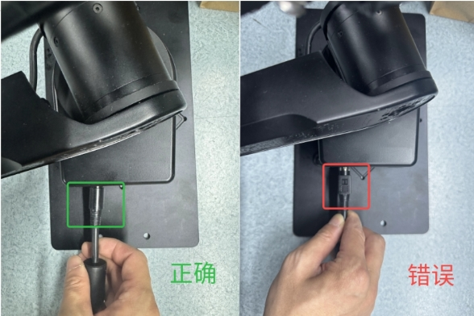

# FAQ  
??? question "AIRBOT Play 机械臂相比于同类型的协作臂的优势是什么？"
    * 体积小，没有外置控制柜，方便集成
    * 重量轻，自重仅3.5kg，可用于各种小型移动平台（四足、轮足、无人机等）。
    * AI+，兼容ALOHA、Mobile ALOHA、 RT-X、VoxPoser等具身智能前沿工作，借助大模型理解自然语言指令，支持一键场景扫描功能，配合高保真仿真器，提高机械臂智能程度。  

??? question "AIRBOT Play 机械臂的供电电压及电流是多少？"
    AIRBOT Play的供电电压范围是直流 24V，最大功率 240W。供电设备最好能提供瞬间最大10A的电流，以供机械臂在各种工况下使用。
    可以使用配件中的电源适配器接入市电使用，也可以通过提供的电源线连接电池或移动电源供电。
    电源适配器的插头防呆，正确插法见下图：

    
    
    
**图4.1 电源连接图**

??? question "AIRBOT Play机械臂的末端可以接哪些执行器？"
    如果是 CAN 接口的末端执行器（如求之自研夹爪 AIRBOT Gripper），可以使用6号关节处的接口；该接口输出电压 24V，额定输出电流 1.15A。
    如果是 RS485 接口的末端执行器，可以使用末端板的 RS485 接口，输出电压 5V / 7V / 24V，额定输出电流 1.15A。  

??? question "AIRBOT Play机械臂的末端可以接哪些相机？"
    机械臂末端板的 USB Type-C 接口可以直接连相机，然后通过机械臂底座板的 USB-1 (TypeC) 接口连接上位机，实现相机的内部走线数据透传。
    已测试可用的相机：舜宇、银牛、V4L2 相机；支持相机种类会持续更新。  

??? question "AIRBOT Play机械臂的主控处理器是什么？"
    目前版本的 AIRBOT Play 机械臂由上位机控制，即将发布的AIRBOT Play **Pro** 将采用内置 X5 处理器。

??? question "目前支持的仿真平台有哪些？"
    目前支持 Isaac Sim、Gazebo 等仿真平台（持续添加中）。

??? question "夹爪的夹取算法包含哪些？是否可以提供？"
    包括 Graspnet / Catgrasp 等模块化抓取算法，以及 voxposer 等端到端规划抓取算法。
    我们可以根据需求，提供相关代码包。

??? question "多模态感知包含哪些？是否可以提供？"
    多模态包括末端视觉、末端触觉、环境语音、场景SOP说明等，多模态感知融合多种环境信息进行长程任务执行。
    我们可以根据需求，提供相关代码包。