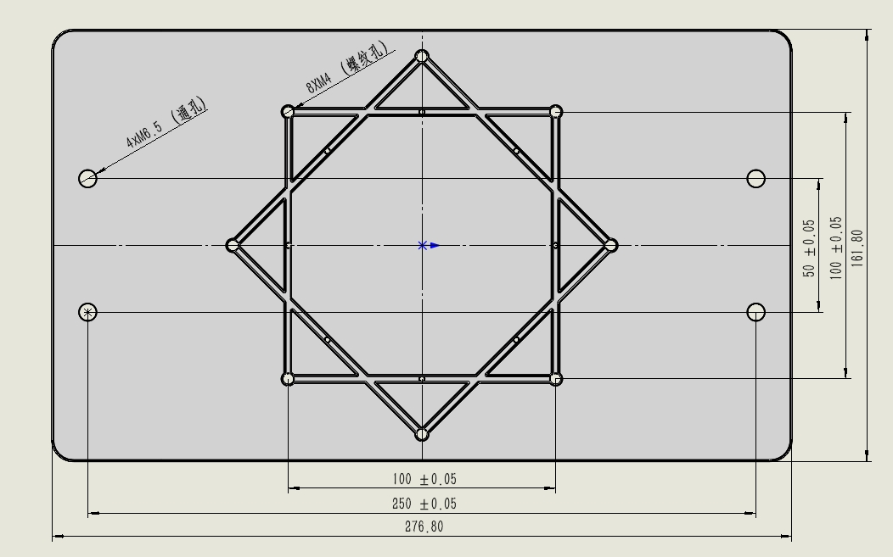
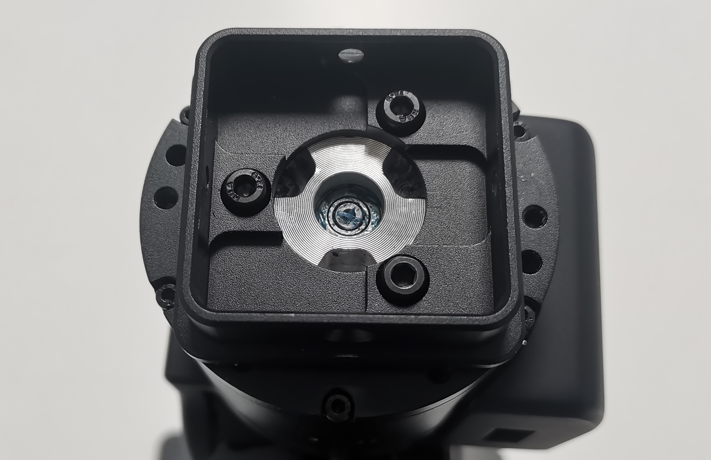
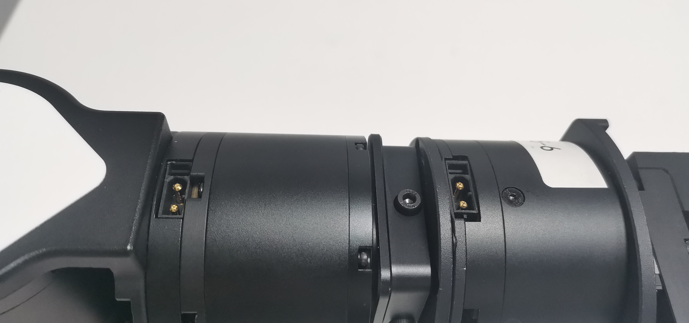
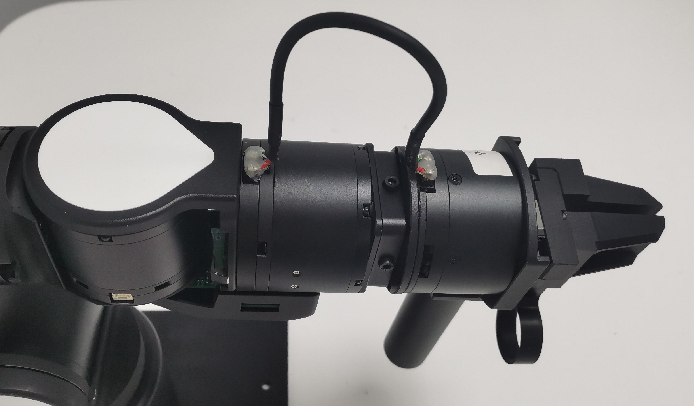

# 机械臂安装说明
## 单臂安装  

### 安装并固定底板 

<div class="grid cards" markdown>

- **安装底板**
	
	---
	

 	取出臂、底板、m4螺丝\*4、L型M4扳手，根据场景按需要的角度（正安装 / 斜 45 度安装）将臂固定在底板上，如下图所示： 
 	
 	 
 	<center>**图2.1 底板**</center>
 	
 	 
 	<center>**图2.2 正安装方式**</center>
 	
 	 
 	<center>**图2.3 斜45度安装方式**</center>


- **固定底版**
	
	---

	在使用机械臂之前，需要将底板固定在稳固的底座上。

    随机械臂附带的 **C 型夹固定方式**可用于将底板固定在桌沿，如下图所示：

      
    <center>**图2.4 底板C型夹固定方式**</center>

	底板也可通过两侧的 M5 通孔 * 4 安装固定在需要的设备上，孔位与尺寸如下图所示：  
	
    
    <center>**图2.5 底板孔位尺寸图**</center>
	</div>

!!! warning "注意："
    安装后必须确定机械臂处于开阔空间，以防机械臂在运动时碰撞到周围的人或物品。


### 安装末端连接件


取出末端连接件、M3 螺丝 * 3、L 型扳手如下图：  

<center></center>

<center>**图2.6 末端连接件及配件**</center>

将末端连接件三个固定销与末端电机安装并用 M3 螺丝 * 3 固定，如下图：  

<div class="grid cards" markdown>

-   <center></center>
    <center>**图2.7 末端连接件固定销*3位置图**</center>

-   <center> </center>
    <center>**图2.8 末端连接件固定完成图**</center>

</div>


## 安装夹爪或示教器 【选配套件】

<div class="grid cards" markdown>

- **安装夹爪**
	
	---
	
	取出夹爪、M4螺丝 * 4，如下为夹爪与连接件固定位，将该放入末端连接件中，固定安装。  
	
	  
	<center>**图2.9 夹爪电机连接固定位置图**</center>
	
	  
	<center>**图2.10 夹爪螺丝位置图**</center>
	
	取出夹爪配套的连接线
	
	
	
	
	<center>**图2.11 夹爪连接线**</center>
	
	找到如下图所示电源插口安装，
	
	!!! warning "注意："
	    避免强行拉拽线，造成接触不良，安装或取下时拔插两个端口处。
	
	
	<center>**图2.12 夹爪安装插口图**</center>
	
	  
	<center>**图2.13 夹爪安装实物图**</center>


- **安装示教器**

	---

	取出示教器、M4螺丝*4，如下为示教器与连接件固定位，将该放入末端连接件中，固定安装。  

      
    <center>**图2.14 示教器电机连接固定位置图**</center>
  
    
    <center>**图2.15 示教器螺丝位置图**</center>
  
    取出示教器配套的连接线
  
    
    <center>**图2.16 示教器连接线**</center>
  
    找到如下图所示电源插口安装
  
    !!! warning "注意："
        避免强行拉拽线，造成接触不良，安装或取下时拔插两个端口处。
  
    
    <center>**图2.17 示教器安装插口图**</center>
  
    
    <center>**图2.18 示教器安装实物图**</center>

</div>

## 底座面板

<div class="grid cards" markdown>

-   
    <center>**图3.1 机械臂面板**</center>

- 
    * 红框部分是开机键，长按3s左右待指示灯条黄色灯珠依次全部亮起，等待黄灯全亮变成白灯全亮后完成开机
    * 红框部分是关机键，长按3s左右待指示灯条黄色灯珠依次全部熄灭，完成关机
    * 绿框部分是电源接口
    * 蓝框部分是通信接口

    !!! info "USB"
        USB-1 (TypeC) 接口用于连接相机，用于视觉传感器数据传输。

        USB-2 (TypeC) 接口用于连接上位机，用于数据传输和控制。

</div>
## 开机与标零
### 准备电脑

在 Ubuntu 20.04 系统安装最新的机械臂软件包，并配置好环境，安装 `airbot_play` 与 `airbot_tools` 两个软件包，安装方式请参考[软件环境配置](../tutorials/env.md)。

### 标零  

请参考[标零说明文档](../tutorials/set_zero.md)进行标零操作。

## 键盘控制  

完成标零操作后，运行键盘控制工具，机械臂进入受控状态：

```shell
airbot_kbd_ctrl
```

在该状态下：

* 点按键盘 `W` / `A` / `S` / `D` / `Q` / `E` 控制机械臂前后左右上下移动
* 点按键盘 `1` - `0` 控制单个关节顺逆时针旋转
* `[` 与 `]` 控制夹爪开合
* 长按末端按键进入重力补偿模式。在该模式下机械臂可被自由拖动；在该模式下短按底座按键开始 / 停止录制动作
* 双击末端按键进入重放待机模式。在该模式下，短按底座按键开始重放动作
* `Ctrl+C` 或 `Z` 退出程序

其他控制工具详见[软件工具使用说明](../tutorials/tools.md)。