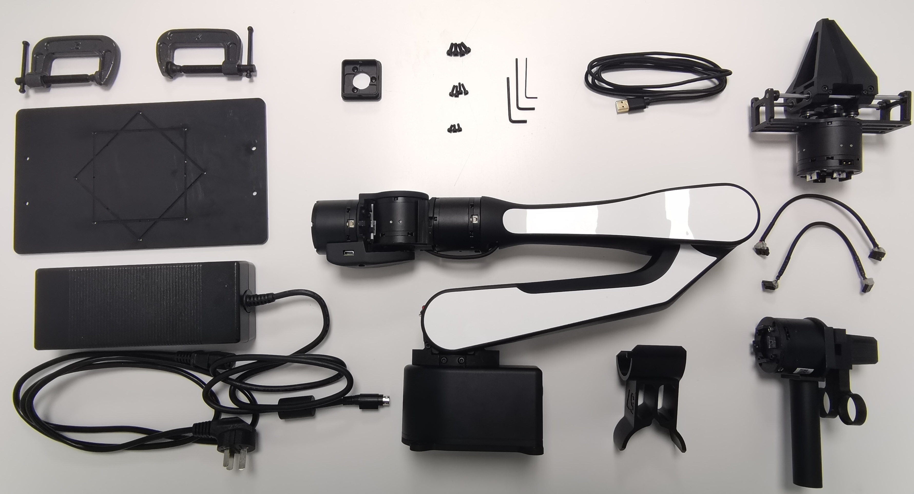

# 机械臂包装清单  
 
  
**图1.1 清单图片（含选配套件)**

| 序号  |        名称        | 数量 / 单位 |         备注         |
| :---: | :----------------: | :---------: | :------------------: |
|   1   | AIRBOT Play 机械臂 |    1 台     |                      |
|   2   |      安装底板      |    1 个     |                      |
|   3   |     固定C型夹      |    2 个     |                      |
|   4   |     末端连接件     |    1 个     |                      |
|   5   |     USB 数据线     |    1 根     |                      |
|   6   |     电源适配器     |    1 个     |                      |
|   7   |       电源线       |    1 根     |                      |
|   8   |        螺丝        |    1 包     | 包含 M3、M4 规格螺丝 |
|   9   |      L 型扳手      |    1 套     | 包含 M3、M4 规格扳手 |
|  10   |      标零工具      |    1 个     |                      |
|  11   |       示教器       |    1 套     |    选配，含连接线    |
|  12   |        夹爪        |    1 套     |    选配，含连接线    |

**表1.1 清单表格**

