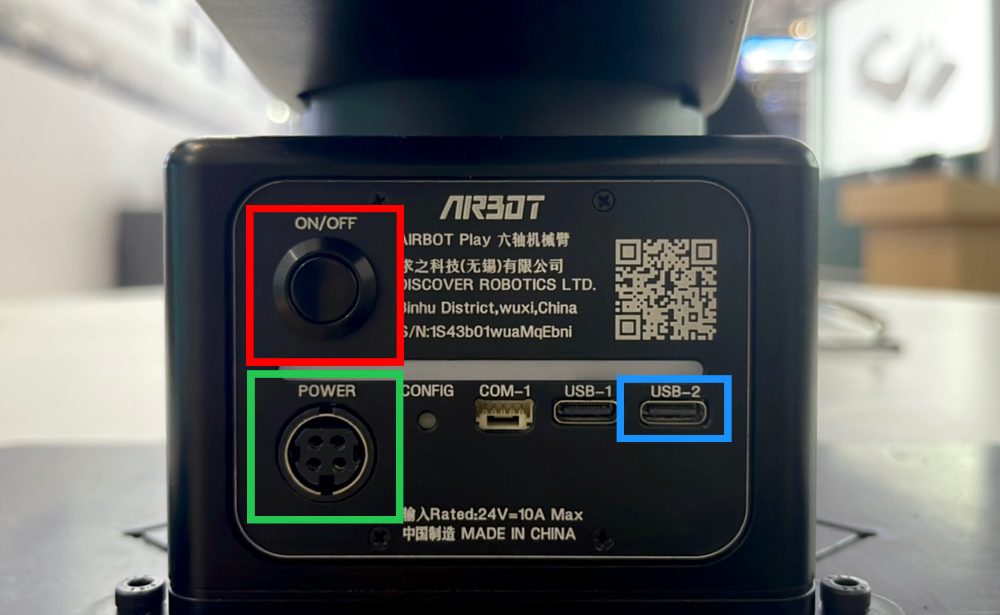
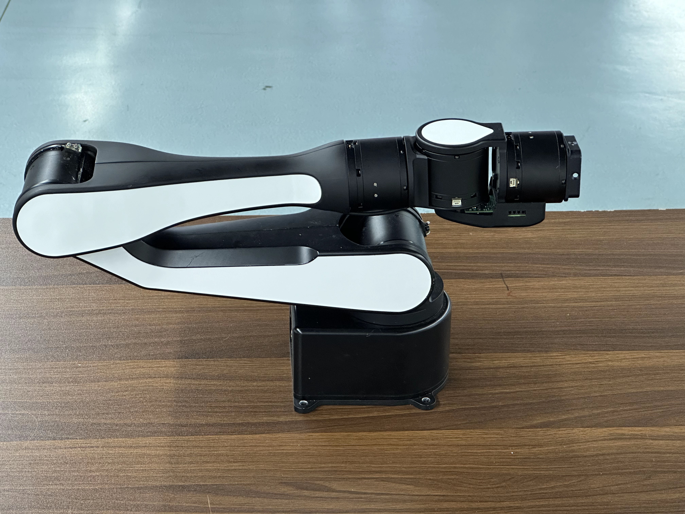
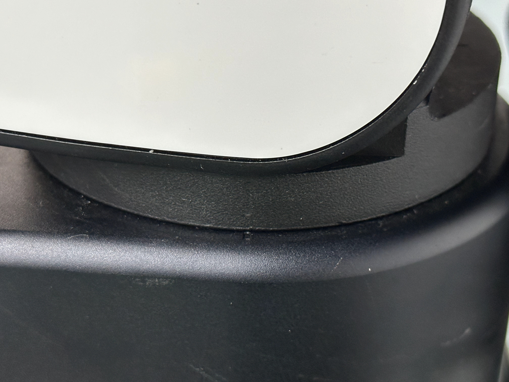
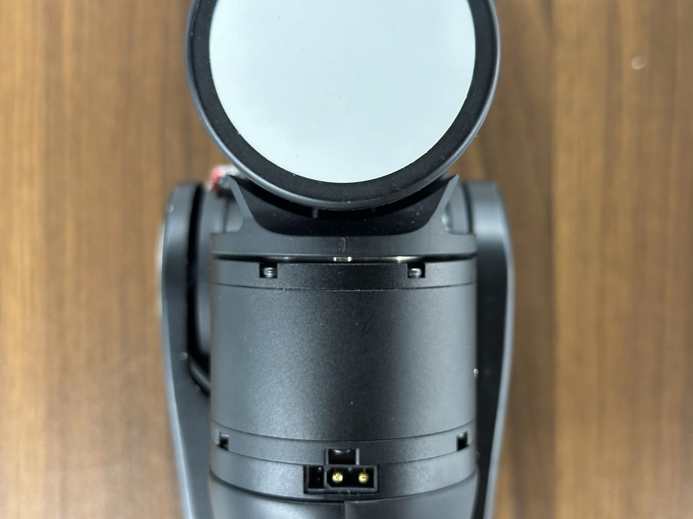
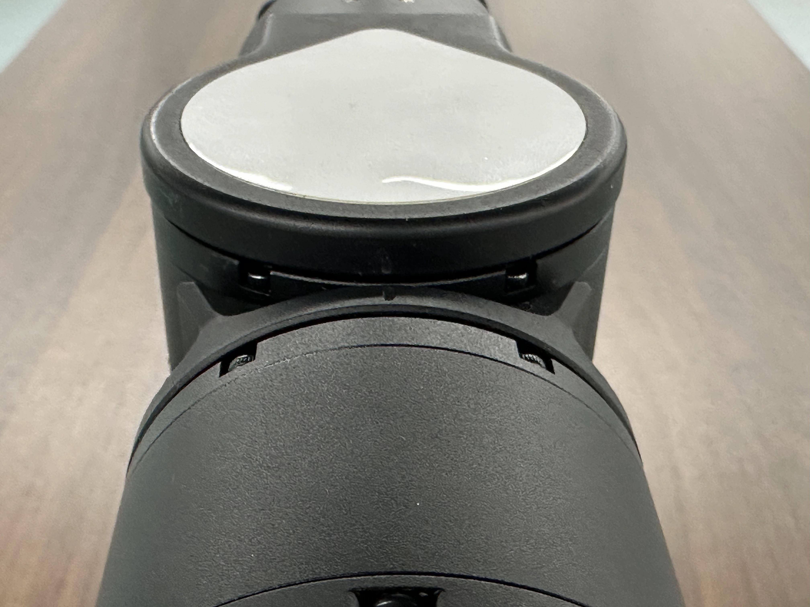

# Zero Position Calibration

Before calibration, `airbot_play` package should be installed first. See [here](../tutorials/env.md).

## Boot up AIRBOT Play

<div class="grid cards" markdown>

-  

- * Attach the power cable to AIRBOT Play. The cable should be plugged into the power port (<span style="color: green">green part</span>).
    * Connect the computer to the AIRBOT Play with a USB cable. The USB cable should be plugged into the USB-2 port (<span style="color: blue">blue part</span>).
    * Press the power button (<span style="color: red">red part</span>) for about 3 seconds until all the yellow light beads light up in turn. Wait for the yellow light to turn white to complete the boot.

</div>

## Manual Zero Calibration

Run the following command, the motors of the robot arm should be released and free to move:

```bash
# Replace <can_device> with the actual CAN device name, e.g. can0
airbot_set_zero -m <can_device>
```

Then, manually drag the robot arm to the zero positions.

???+ tip "Positions of Motors during Manual Calibration"
    The positions for manual calibration are:

    

    Specifically, for the six motors of the robot arm:

    <div class="grid cards" markdown>

    - **Motor 1**: Align the markers on the right side of the arm base:

    - 
    
    - **Motor 2 and 3**: Release the arm and let the motors move freely according to gravity.
    
    - 
    
    - **Motor 4**: Align the markers on the top side of the arm:
      
    - 

    - **Motor 5**: Align the markers on the top side of the arm:

    - 

    - **Motor 6**: Manually rotate the motor so that the end effector is horizontal

    - 

    </div>

After the robot arm is in positions for calibration, press `Enter` to complete the calibration. Clicking sounds will be heard as the first three motors are locked in the calibration positions.