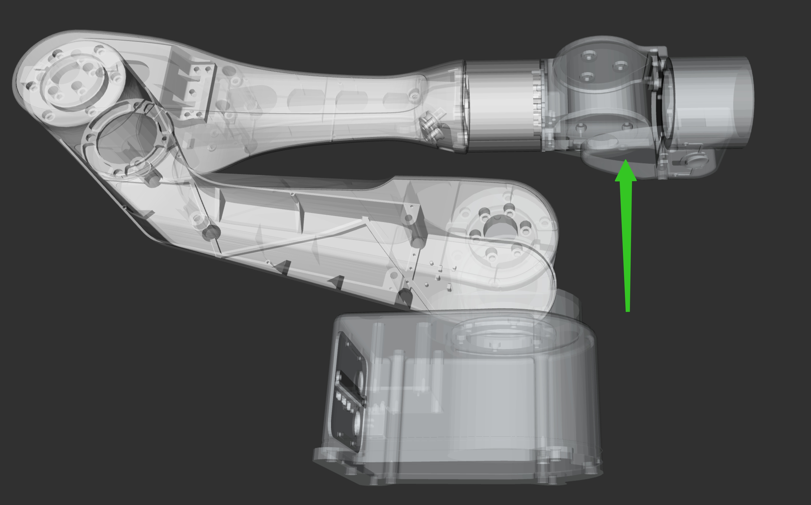

# Tool Usage for AIRBOT Play

In this tutorial, we introduce several tools for AIRBOT Play, including:

* `airbot_set_zero`: Zero Position Calibration
* `airbot_read_params`: Read Status and Parameters
* `airbot_kbd_ctrl`: Keyboard Control
* `airbot_sync`: Synchronization between two AIRBOT Play arms
* `airbot_demonstrate`: Data collection with AIRBOT Play
* `airbot_demonstrate_dual`: Data demonstration with two AIRBOT Play arms

## `airbot_set_zero`

Calibrate the zero position of the robot. See the tutorial [here](set_zero.md).

## `airbot_read_params`

Read the status and parameters of AIRBOT Play (e.g., firmware version and serial number of boards and motors).

The output will be similar to the following:

```shell
# airbot_read_params

#    ID      Board Type  Ver.    Serial Number     Arm Serial Num.   Status  Pos(rad)     Vel(rad/s)   Current(A)
Board#0:     Base board  V2.8.0  DZ21JH002416058Z  PZ25C02401000054  YYYYYY
Board#1:       OD motor  V2.8.1  DJ25FL012400420E  PZ25C02401000054  YYYYYY  pos:  0.0000 vel:  0.0000 cur:  0.0000
Board#2:       OD motor  V2.8.1  DJ25FL012400417I  PZ25C02401000054  YYYYYY  pos:  0.1745 vel:  0.0000 cur:  0.0000
Board#3:       OD motor  V2.8.1  DJ25FL012400415G  PZ25C02401000054  YYYYYY  pos: -0.0873 vel:  0.0000 cur:  0.0000
Board#4:       DM motor    3163  ----------------  ----------------  YYYYYY  pos:  1.5440 vel: -0.0073 cur: -0.0024
Board#5:       DM motor    3163  ----------------  ----------------  YYYYYY  pos: -1.4445 vel: -0.0220 cur: -0.0024
Board#6:       DM motor    3163  ----------------  ----------------  YYYYYY  pos: -0.0010 vel: -0.0220 cur: -0.0024
Board#8:      End board  V2.7.0  MD20JH002401082G  PZ25C02401000054  YYYYYY
```

Command line options:

* `-e`: specify the end effector attached to the arm. Default: `none`. Available options:
    * `none`: No end effector is attached
    * `gripper`: AIRBOT Gripper 2 is attached
    * `newteacher`: AIRBOT Demonstrator 2 v1 is attached
    * `teacherv2`: AIRBOT Demonstrator 2 v2 is attached
* `-m`: specify the can device interface of the arm. Default: `can0`


Reference: 

```shell
# airbot_read_params -h

A simple program to read the parameters of the boards on the arm.

Optional arguments:
  -h, --help             shows help message and exits
  -v, --version          prints version information and exits
  -m, --master           Can device interface of the master arm. Default: can0 [nargs=0..1] [default: "can0"]
  -e, --master-end-mode  The mode of the master arm end effector. Available choices:
                         "teacher": The demonstrator equipped with Damiao motor
                         "gripper": The gripper equipped with Damiao motor
                         "yinshi": The Yinshi two-finger gripper
                         "newteacher": The demonstrator equipped with self-developed motor
                         "teacherv2": The V2 version of demonstrator equipped with self-developed motor
                         "none": The arm is not equipped with end effector. [nargs=0..1] [default: "none"]
  --forearm-type         The type of forearm. Available choices: "DM": Damiao motor, "OD": Self-developed motors [nargs=0..1] [default: "DM"]
  --verbose              Display more detailed information about motors
```

## `airbot_kbd_ctrl`

This tool allows you to control the AIRBOT Play arm using the keyboard.

!!! warning "Zero Position Calibration needed"
    If these situations apply, zero position calibration <span style="color: red">must be performed</span> before controlling the arm, otherwise the robot may not work as expected or even cause <span style="color: red">**SEVERE DAMAGE**</span>:

    * This is the first time the robot is powered on
    * The joint #1, #2 and #3 are forced to move during power-off despite locked
    * The program breaks down during another operation, and the robot is powered off and on again

    See the tutorial [here](set_zero.md) for detailed operations.

!!! warning "Firmware Version"
    All controlling methods require compatible firmware versions. Please make sure firmwares of all boards (base interface boards, motor boards, and end interface boards) are updated to the firmwares provided in the corresponding software package.

    The firmware version of the boards can be checked using the [`airbot_read_params`](#airbot_read_params) tool.

### CLI options

* `-e`: specify the end effector attached to the arm. Default: `none`. Available options:
    * `none`: No end effector is attached
    * `gripper`: AIRBOT Gripper 2 is attached
    * `newteacher`: AIRBOT Demonstrator 2 v1 is attached
    * `teacherv2`: AIRBOT Demonstrator 2 v2 is attached
* `-m`: specify the can device interface of the arm. Default: `can0`
* `-t`: specify the path to a trajectory file. Default: `none`. If specified, the arm will be able to replay the given trajectory.
* `-d`: specify the direction of gravity. This is useful when the arm is not installed on a horizontal surface. Default: `down`. Available options:
    * `down`: Gravity direction is downward
    * `left`: Gravity direction is leftward
    * `right`: Gravity direction is rightward

### Reference

```shell
# airbot_kbd_ctrl -h

Usage: airbot_kbd_ctrl [--help] [--version] --master VAR [--node VAR...] [--master-end-mode VAR] [--trajectory VAR] [--direction VAR] [--urdf VAR] [--master-speed VAR] [--constrained] [--bigarm-type VAR] [--forearm-type VAR]

A simple program to control AIRBOT Play via keyboard.

Optional arguments:
  -h, --help             shows help message and exits
  -v, --version          prints version information and exits
  -m, --master           Can device interface of the master arm. [nargs=0..1] [default: "can0"]
  -n, --node             Can device interface of the following arm. Can use multiple times (multiple following arms). E.g., -n can1 can2 [nargs: 0 or more] [default: {}]
  -e, --master-end-mode  The mode of the master arm end effector. Available choices:
                         "teacher": The demonstrator equipped with Damiao motor
                         "gripper": The gripper equipped with Damiao motor
                         "yinshi": The Yinshi two-finger gripper
                         "newteacher": The demonstrator equipped with self-developed motor
                         "teacherv2": The V2 version of demonstrator equipped with self-developed motor
                         "none": The arm is not equipped with end effector. [nargs=0..1] [default: "newteacher"]
  -t, --trajectory       The trajectory file to replay [nargs=0..1] [default: ""]
  -d, --direction        The gravity direction. Useful for arms installed vertically [nargs=0..1] [default: "down"]
  -u, --urdf             Manually provided URDF path to override default paths. [nargs=0..1] [default: ""]
  --master-speed         The joint speed of the master arm in ratio of PI. [nargs=0..1] [default: 1]
  --constrained          Stop arm when going out of bounds in gravity compensation mode. False by default
  --bigarm-type          The type of bigarm. Available choices: "encoder": Self-developed encoders, "OD": Self-developed motors [nargs=0..1] [default: "OD"]
  --forearm-type         The type of forearm. Available choices: "DM": Damiao motor, "OD": Self-developed motors, "encoder": Self-developed encoders [nargs=0..1] [default: "DM"]
```

### Keyboard Mappings

After launching `airbot_kbd_ctrl`, you can control the robot using the keyboard. The following table lists the keyboard mappings for controlling the robot.

#### Common Keys
| Key | Description |
| --- | --- |
| `z` or `Ctrl + c` | Return to zero position and exit |
| <code>`</code> | return to zero position |
| `x` | Switch to [manual mode](states.md#manual-mode) |
| `c` | Switch to [online mode](states.md#online-mode) |
| `v` | Switch to [offline mode](states.md#offline-mode) |
| `b` | Start or stop trajectory recording (in manual mode) |
| `n` | Start trajectory replay (in offline mode) |
| `/` | Try to reset error when in error mode|

???+ tip "Switching Modes via Button"
    You can also switch modes by pressing the button on the end of AIRBOT Play. 
    
    See the [states tutorial](states.md) for more details.

#### End Effector Pose Control

!!! note "Base Frame and Tool Frame"

    We define <u>**base frame**</u> as the frame fixed on the base of the robot, with x-axis pointing forward, y-axis pointing to the left, and z-axis pointing upward.
    
    We define <u>**tool frame**</u> as the frame fixed on the end effector of the robot, with x-axis pointing downward, y-axis pointing to the left, and z-axis pointing forward.
    
    By default the control is in the **base frame**. Press `r` to switch between controlling in the **tool frame** or in the **base frame**.
    
    


!!! note "Moving Step"
    
    When controlling via keyboard, the end effector pose is updated by **a fixed step** on each key press.
    
    By default the translation step is 10cm and the rotation step is `pi / 10`. Press `t` to switch between 10cm and 1cm for translation, and `pi / 10` and `pi / 100` for rotation.

| Key | Description | Key | Description |
| --- | --- | --- | --- |
| `r` | Switch between controlling in the base frame or in the tool frame  | `t` | Switch moving step between: <br /> 10cm and 1cm (for translation) <br /> `pi / 10` and `pi / 100` (for rotation)|
| `w` | <span style="color: red">**Step forward**</span>: Translate endpoint pose by a fixed step along x-axis forward | `i` | <span style="color: green">**Spin pitch C.W.**</span>: Rotate endpoint pose by a fixed angle along y-axis counter clock-wise |
| `s` | <span style="color: red">**Step backward**</span>: Translate endpoint pose by a fixed step along x-axis backward  | `k` | <span style="color: green">**Spin pitch C.C.W.**</span>: Rotate endpoint pose by a fixed angle along y-axis clock-wise |
| `a` | <span style="color: green">**Step left**</span>: Translate endpoint pose by a fixed step along y-axis leftward  | `j` | <span style="color: cyan">**Spin yaw C.W.**</span>: Rotate endpoint pose by a fixed angle along z-axis counter clock-wise |
| `d` | <span style="color: green">**Step right**</span>: Translate endpoint pose by a fixed step along y-axis rightward  | `l` | <span style="color: cyan">**Spin yaw C.C.W.**</span>: Rotate endpoint pose by a fixed angle along z-axis clock-wise |
| `q` | <span style="color: cyan">**Step up**</span>: Translate endpoint pose by a fixed step along z-axis upward  | `u` | <span style="color: red">**Spin roll C.W.**</span>: Rotate endpoint pose by a fixed angle along x-axis counter clock-wise |
| `e` | <span style="color: cyan">**Step down**</span>: Translate endpoint pose by a fixed step along z-axis downward  | `o` | <span style="color: red">**Spin roll C.C.W.**</span>: Rotate endpoint pose by a fixed angle along x-axis clock-wise |


#### Joint Control

??? note "Rotation Directions for Joints"
    When performing joint control, each joints rotates around the <span style="color: blue" ><strong>z-axis</strong></span> of the joint frame.

    The positive direction of rotation is defined as consistent with <u>**the right-hand rule**</u>, i.e., the thumb points in the positive direction of the z-axis, the fingers curl in the positive direction of rotation.

    The following images show the positive direction of rotation for joint #1 to joint #6.

    
    
    
    
    
    

| Key | Description | Key | Description |
| --- | --- | --- | --- |
| `1` | Rotate a fixed step along positive direction of joint #1 | `2` | Rotate a fixed step along negative direction of joint #1 |
| `3` | Rotate a fixed step along positive direction of joint #2 | `4` | Rotate a fixed step along negative direction of joint #2 |
| `5` | Rotate a fixed step along positive direction of joint #3 | `6` | Rotate a fixed step along negative direction of joint #3 |
| `7` | Rotate a fixed step along positive direction of joint #4 | `8` | Rotate a fixed step along negative direction of joint #4 |
| `9` | Rotate a fixed step along positive direction of joint #5 | `0` | Rotate a fixed step along negative direction of joint #5 |
| `-` | Rotate a fixed step along positive direction of joint #6 | `=` | Rotate a fixed step along negative direction of joint #6 |

#### End effector Control

When an end effector (e.g., AIRBOT Gripper 2) is attached to AIRBOT Play, you can control the gripper using the following keys:

| Key | Description |
| --- | --- |
| `[` | Close the gripper |
| `]` | Open the gripper |

!!! note "CLI Arguments Needed when Launching with End Effector"

    In order to control the end effector, you need to specify the end effector type when launching the tool. For example, to control the AIRBOT Gripper 2, you need to specify `-e gripper`.


## `airbot_sync`

This tool allows you to performing tele-operation of two AIRBOT Play arms by synchronizing their movements.

!!! warning "Zero Position Calibration needed"
    If these situations apply, zero position calibration <span style="color: red">must be performed</span> before controlling the arm, otherwise the robot may not work as expected or even cause <span style="color: red">**SEVERE DAMAGE**</span>:

    * This is the first time the robot is powered on
    * The joint #1, #2 and #3 are forced to move during power-off despite locked
    * The program breaks down during another operation, and the robot is powered off and on again

    See the tutorial [here](set_zero.md) for detailed operations.

!!! warning "Firmware Version"
    All controlling methods require compatible firmware versions. Please make sure firmwares of all boards (base interface boards, motor boards, and end interface boards) are updated to the firmwares provided in the corresponding software package.

    The firmware version of the boards can be checked using the [`airbot_read_params`](#airbot_read_params) tool.

### CLI options

* `-m`: specify the can device interface of the leader arm. Default: `can0`
* `-n`: specify the can device interface of the follower arm. Default: `can1`
* `-d`: specify the gravity direction for the leader arm. Default: `down`. Available options:
    * `down`: Gravity direction is downward
    * `left`: Gravity direction is leftward
    * `right`: Gravity direction is rightward
* `--leader-end-mode`: specify the end effector attached to the leader arm. Default: <strong><code><span style="color: green">newteacher</span></code></strong>. Refer to [end effector doc](../manual/end_effectors.md) for further information. Available options:
    * `none`: No end effector is attached
    * `gripper`: AIRBOT Gripper 2 is attached
    * `newteacher`: AIRBOT Demonstrator 2 v1 is attached
    * `teacherv2`: AIRBOT Demonstrator 2 v2 is attached
* `--follower-end-mode`: specify the end effector attached to the follower arm. Default: <strong><code><span style="color: red">gripper</span></code></strong>. Available options:
    * `none`: No end effector is attached
    * `gripper`: AIRBOT Gripper 2 is attached
    * `newteacher`: AIRBOT Demonstrator 2 v1 is attached
    * `teacherv2`: AIRBOT Demonstrator 2 v2 is attached
* `--mit`: specify the control mode of the follower arm. With `--mit`, the joints of the follower arm will be controlled via MIT mode (Force/Torque control)

### Reference

```shell
# airbot_sync -h

Usage: airbot_sync [--help] [--version] [--urdf VAR] --leader VAR --follower VAR [--direction VAR] [--leader-end-mode VAR] [--follower-end-mode VAR] [--leader-speed VAR] [--follower-speed VAR] [--leader-forearm-type VAR] [--follower-forearm-type VAR] [--leader-bigarm-type VAR] [--follower-bigarm-type VAR] [--mit]

Optional arguments:
  -h, --help               shows help message and exits
  -v, --version            prints version information and exits
  -u, --urdf               Manually provided URDF path to override default paths. [nargs=0..1] [default: ""]
  -m, --leader             Can device interface of the master arm. [nargs=0..1] [default: "can0"]
  -n, --follower           Can device interface of the following arm. [nargs=0..1] [default: "can1"]
  -d, --direction          The gravity direction. Useful for arms installed vertically [nargs=0..1] [default: "down"]
  --leader-end-mode        The mode of the master arm end effector. Available choices:
                           "teacher": The demonstrator equipped with Damiao motor
                           "gripper": The gripper equipped with Damiao motor
                           "yinshi": The Yinshi two-finger gripper
                           "newteacher": The demonstrator equipped with self-developed motor
                           "teacherv2": The V2 version of demonstrator equipped with self-developed motor
                           "none": The arm is not equipped with end effector. [nargs=0..1] [default: "newteacher"]
  --follower-end-mode      The mode of the master arm end effector. Available choices:
                           "teacher": The demonstrator equipped with Damiao motor
                           "gripper": The gripper equipped with Damiao motor
                           "yinshi": The Yinshi two-finger gripper
                           "newteacher": The demonstrator equipped with self-developed motor
                           "teacherv2": The V2 version of demonstrator equipped with self-developed motor
                           "none": The arm is not equipped with end effector. [nargs=0..1] [default: "gripper"]
  --leader-speed           The joint speed of the master arm in percentage of PI. [nargs=0..1] [default: 3.14159]
  --follower-speed         The joint speed of the follower arm in percentage of PI. [nargs=0..1] [default: 9.42478]
  --leader-forearm-type    The type of forearm of leader. Available choices: "DM": Damiao motor, "OD": Self-developed motors, "encoder": Self-developed encoders. [nargs=0..1] [default: "DM"]
  --follower-forearm-type  The type of forearm of follower. Available choices: "DM": Damiao motor, "OD": Self-developed motors "encoder": Self-developed encoders. [nargs=0..1] [default: "DM"]
  --leader-bigarm-type     The type of bigarm of leader. Available choices: "OD": Self-developed motors, "encoder": Self-developed encoders. [nargs=0..1] [default: "OD"]
  --follower-bigarm-type   The type of bigarm of follower. Available choices: "OD": Self-developed motors "encoder": Self-developed encoders. [nargs=0..1] [default: "OD"]
  --mit                    Enable force feedback control.
```

### Keyboard Mappings

After launching `airbot_sync`, you can control the leader arm using the keyboard. The following table lists the keyboard mappings for controlling the follower arm.

| Key | Description |
| --- | --- |
| `z` or `Ctrl + c` | Return to zero position and exit |
| <code>`</code> | return to zero position |
| `x` | Switch leader arm to [manual mode](states.md#manual-mode) |
| `c` | Switch leader arm to [online mode](states.md#online-mode) |
| `v` | Switch leader arm to [offline mode](states.md#offline-mode) |
| `b` | Start or stop trajectory recording (in manual mode) |
| `n` | Start trajectory replay (in offline mode) |
| `/` | Try to reset error when in error mode|

???+ tip "Switching Modes via Button"
    You can also switch modes by pressing the button on the end of AIRBOT Play. 
    
    See the [states tutorial](states.md) for more details.

## `airbot_demonstrate`

TBD

## `airbot_demonstrate_dual`

TBD