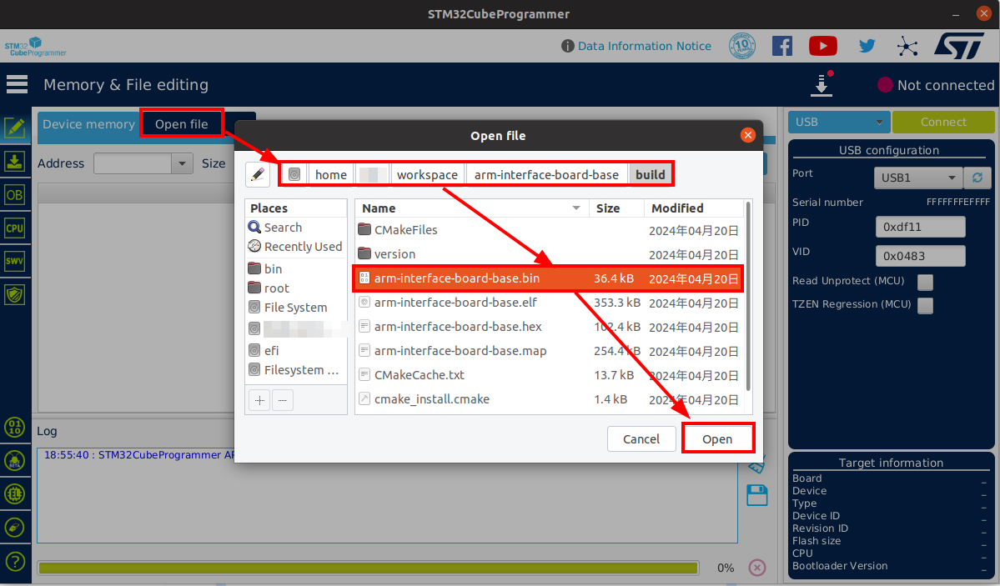

# AIRBOT Play Firmware Upgrade Guide

In this tutorial, we will show the detailed operations for upgrading the firmware of AIRBOT Play.

After obtaining the [SDK package](#firmware-package), the upgrade of AIRBOT Play firmware consists of upgrading [base interface board](#upgrading-base-interface-board), [motor controller firmware](#upgrading-motor-controller-firmware) and [end interface board firmware](#upgrading-end-interface-board).

## SDK Package

Please contact technical support: [contact@discover-robotics.com](mailto:contact@discover-robotics.com) to obtain the SDK package. After extracting the SDK package, the directory structure is as follows:
```shell
# tree 2.8.3/
.
├── CHANGELOG
├── SHA1.txt
├── firmwares
│   ├── BLDC_4_ChibiOS.bin                                   # Motor controller firmware
│   ├── arm-interface-board-base.bin                         # Base interface board firmware 
│   └── end                                                  # End interface board firmware for different end effectors
│       ├── arm-interface-board-end_desheng_servo.bin
│       ├── arm-interface-board-end_jodell_2_fingers.bin
│       ├── arm-interface-board-end_jodell_suction_cup.bin
│       └── arm-interface-board-end_yingshi_2_fingers.bin
└── packages
    ├── airbot_aloha_2.8.3-291bbb4_amd64.deb                 # Data collection example package, depends on the basic control library package
    ├── airbot_play_2.8.3-a117c2fe_amd64.deb                 # Basic control library package, provides support for various interfaces
    ├── airbot_tools_2.8.3-291bbb4_amd64.deb                 # Example tools package, depends on the basic control library package
    ├── ros-noetic-ros-interface_2.8.3-0focal_amd64.deb      # ROS Interface package, depends on the basic control library package
    └── sdk-develop-python.zip
```

Each upgrade comes with update of both firmwares and packages. The usage of packages can be found [here](../tutorials/env.md). The upgrade process only needs files under the `firmwares` directory.

## Upgrading Base Interface Board

### Preparing environment: STM32CubeProgrammer

Download STM32CubeProgrammer version **`2.15`** from [here](https://www.st.com/en/development-tools/stm32cubeprog.html):

!!! warning "Version `2.15` is mandatory"
    Versions higher than `2.15` have known issues which would causes <span style='color:red'>**HARDWARE DAMAGE**</span> of the interface board.

??? "Verbose steps"
    
    click on `Select Version` choose version `2.15`, then click `Accept` and `Download as Guest` in sequence.

Extract and install the downloaded package with the following command:

```bash
./SetupSTM32CubeProgrammer-2.15.0.linux
```

Store the installation path as `CUBE_INSTALL_PATH` environment variable: (replace `/path/to/installation` with the actual installation path)
```shell
echo "export CUBE_INSTALL_PATH=/path/to/installation" >> ~/.bashrc
source ~/.bashrc
```

??? "Verbose steps"
    In the pop-up window, click `Next`, `Next` select `I accept the terms of the license agreements` then click `Next`
    
    You can customize the installation path here. After selecting the path, click `Next`. If the path does not exist, a pop-up window will prompt that the target folder will be created. Click `OK`.
    Then, check `I have read and understood the ST Terms of Use` and keep clicking `Next` until the installation completes, then click `Done`.


### Burn Firmware

1. Detach the power supply and USB cable from the base and wait for 20 seconds.

2. Press **DOWN** the CONFIG button with a thin tool and then attach a USB Type-C cable to USB-2 port. Make sure power supply is **NOT** attached.

    ??? info "CONFIG button on the base"
        

3. Connect the other end of the USB Type-C cable to the computer with STM32CubeProgrammer installed.

4. Suppose STM32CubeProgrammer is installed at `CUBE_INSTALL_PATH`. Launch STM32CubeProgrammer with

    ```bash
    sudo ${CUBE_INSTALL_PATH}/bin/STM32CubeProgrammer
    ```
    ??? info "Initial Interface for STM32CubeProgrammer"
        

5. Select `USB` as the communication method, and click the refresh button. You should see `USB1` appears.

    

    ??? question "USB1 not showing?"
        If the USB1 option is now showing, please make sure the CONFIG button is pressed **DOWN** and the USB cable is firmly attached to the base and the computer

6. Click `Connect`

7. Select the firmware: `arm-interface-board-base.bin` inside the upgrade package:

    

8. After the firmware is loaded, click `Download` to burn firmware. It takes around 10 seconds, with a green line <span style='color: lightgreen'>File download complete</span> indicating successful burning.

    

9. Click `OK`. You can close STM32CubeProgrammer now.

10. Detach the USB cable from the base and **THEN** use a thin tool to press **UP** the config button. The upgrade of the base interface board is complete now.

## Upgrading Motor Controller Firmware

The 1st to 3rd motor controllers are connected to the base interface board. The firmware of the motor controller can be upgraded by running the following commands.

!!! warning "Power Supply"
    Make sure the power supply is attached to the AIRBOT Play when upgrading the firmware.

!!! info "Install `airbot_play` first"
    Before upgrading the motor controller firmware, the `airbot_play` package should be installed first. See [here](./env.md).

Suppose only one AIRBOT Play arm is connected to the computer (which makes the device name `can0`), run the following command to upgrade the firmware for the first motor:

```bash
# Upgrade the firmware for the first motor of can0 device
python3 -m airbot_play.iap_burn [<path_to_firmware>] -m can0 -i 1
```

!!! danger "Firmware Selection"
    Please select the correct firmware for the end effector connected to the AIRBOT Play. The firmware for the motor controller is `BLDC_4_ChibiOS.bin` in the `firmwares` directory of the SDK package.

    Once the wrong firmware is burned, the whole AIRBOT Play would fail to work **AT ALL**. If the wrong firmware has already been burnt, please contact technical support: [contact@discover-robotics.com](mailto:contact@discover-robotics.com) for further assistance.

Replace `<path_to_firmware>` with the path to the firmware file `BLDC_4_ChibiOS.bin` in the SDK package.

!!! tip "Program Output"
    ```
    # python iap.py BLDC_4_ChibiOS.bin -i 1 -m can0
    Device name: vesc-motor-control
    Device detected.
    Version: 2.6.0
    Request successful. Starting data transmission.
    Transmitting data... ━━━━━━━━━━━━━━━━━━━━━━━━━━━━━━━━━━━━━━━╸ 100% 0:00:00
    End request successful. Data transmit finished.
    Please wait for the program auto close and don't shutdown the power supply now.
    Burning firmware... ━━━━━━━━━━━━━━━━━━━━━━━━━━━━━━━━━━━━━━━━ 100% 0:00:00
    Burn finished.
    Version: 2.7.0
    Time elapsed: 40.14004611968994 seconds
    ```

The version of the firmware will be displayed in the output. If the version is updated to the latest version, the upgrade is successful.

Then, run the following commands to upgrade the firmware for the 2nd and 3rd motor:

```bash
# Upgrade the firmware for the 2nd motor of can0 device
python3 -m airbot_play.iap_burn [<path_to_firmware>] -m can0 -i 2
# Upgrade the firmware for the 3rd motor of can0 device
python3 -m airbot_play.iap_burn [<path_to_firmware>] -m can0 -i 3
```

!!! note 
    If the end effector (AIRBOT Gripper or AIRBOT Demonstrator) is connected, the firmware of the controller can be updated by running the following command:
    
    ```
    python3 -m airbot_play.iap_burn [<path_to_firmware>] -m can0 -i 7
    ```

## Upgrading End Interface Board

!!! danger "Firmware Selection"
    Please select the correct firmware for the end effector connected to the AIRBOT Play. The firmware files are located in the `end` directory of the SDK package.

    Once the wrong firmware is burned, the whole AIRBOT Play would fail to work **AT ALL**. If the wrong firmware has already been burnt, please contact technical support: [contact@discover-robotics.com](mailto:contact@discover-robotics.com) for further assistance.

!!! warning "Power Supply"
    Make sure the power supply is attached to the AIRBOT Play when upgrading the firmware.

!!! info "Install `airbot_play` first"
    Before upgrading the motor controller firmware, the `airbot_play` package should be installed first. See [here](./env.md).

The end interface board firmware can be upgraded by running the following command:

```bash
# Upgrade the firmware for the end interface board of can0 device
python3 -m airbot_play.iap_burn [<path_to_firmware>] -m can0 -i 8
```

Replace `<path_to_firmware>` with the path to the firmware file `arm-interface-board-end_*.bin` in the SDK package. Any one of the four end interface board firmware can be selected.