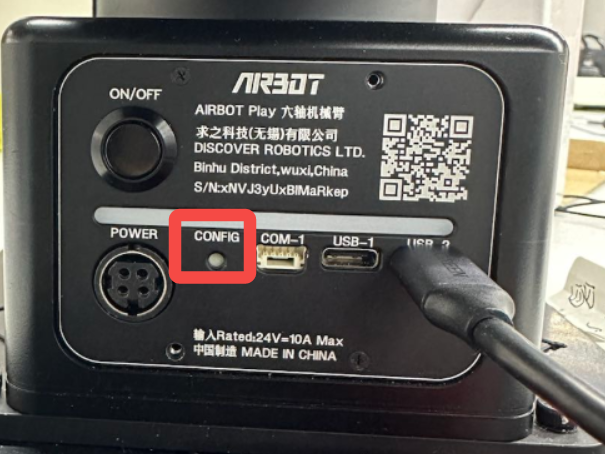
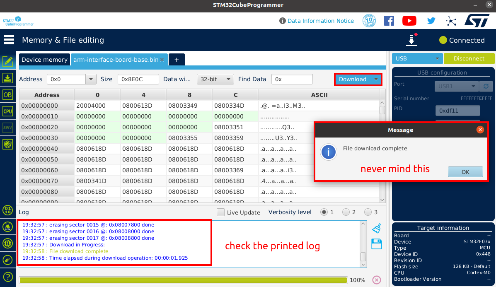

# Firmware Burning for Mechanical Arm Base Interface Board

## Download Firmware

[arm-interface-board-base.bin](https://127.0.0.1)

## Install CubeProgrammer

[CubeProgrammer Download Link](https://www.st.com/en/development-tools/stm32cubeprog.html)

Follow the steps below to download the software:

Since the development platform is Ubuntu, select the Linux version, click on `Select Version` choose version `2.15` (version 2.16 has known bugs), then click `Accept` and `Download as Guest` in sequence.

Extract the software package, navigate to the extracted directory in the terminal, and run the following command:
```bash
./SetupSTM32CubeProgrammer-2.15.0.linux
```
In the pop-up window, click `Next`, `Next` select `I accept the terms of the license agreements` then click `Next`

You can customize the installation path here. After setting the path, select and copy it.
Then open a terminal, and enter the following commands:
```
export CUBEPATH='copied_path'
echo "alias stm32cube='sudo $CUBEPATH/bin/STM32CubeProgrammer'" >> ~/.bashrc
```
For example:

Close the terminal.

After selecting the path, click `Next`. If the path does not exist, a pop-up window will prompt that the target folder will be created. Click `OK`.
Then, check `I have read and understood the ST Terms of Use` and keep clicking `Next` until the installation completes, then click `Done`.


## Burn Firmware
Use a DuPont wire/toothpick or similar slender tool to press the CONFIG button, ensuring that the base interface board is powered off at this time (neither POWER nor USB cables are connected).

Connect USB-2 port to the computer using a Type-C data cable.

Open a terminal and enter the following command to open the burning software

```bash
stm32cude
```

Select `USB` as the communication method, click "Refresh button" (if not refreshed, please check if the config button is pressed), and the appearance of USB1 indicates successful detected the base board. Then you can click `Connect`

Then, follow the steps shown in the figure below to navigate to the firmware download directory, select the firmware, and click `Open` to load the firmware.

After preparation, click `Download`. Wait for about 10 seconds, if the following information is output, it indicates successful burning. Click `OK`.

At this point, the firmware upgrade of the baseboard is completed. If you want to close the software, do not directly click the cross button. Instead, please click the terminal used to open the software and press Ctrl+C to close the software (or directly close this terminal).
