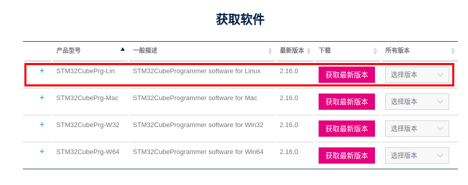
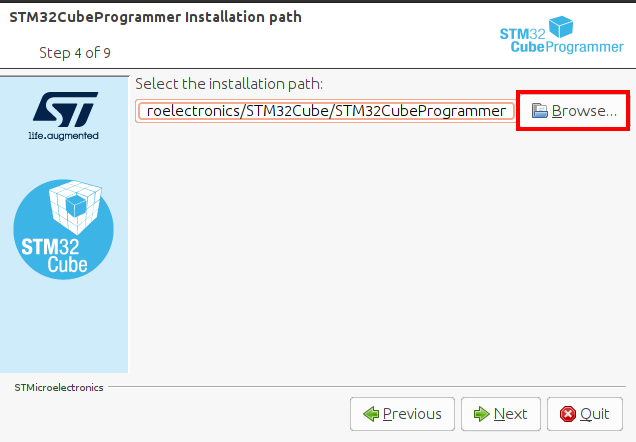
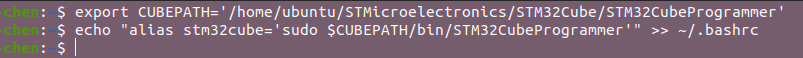
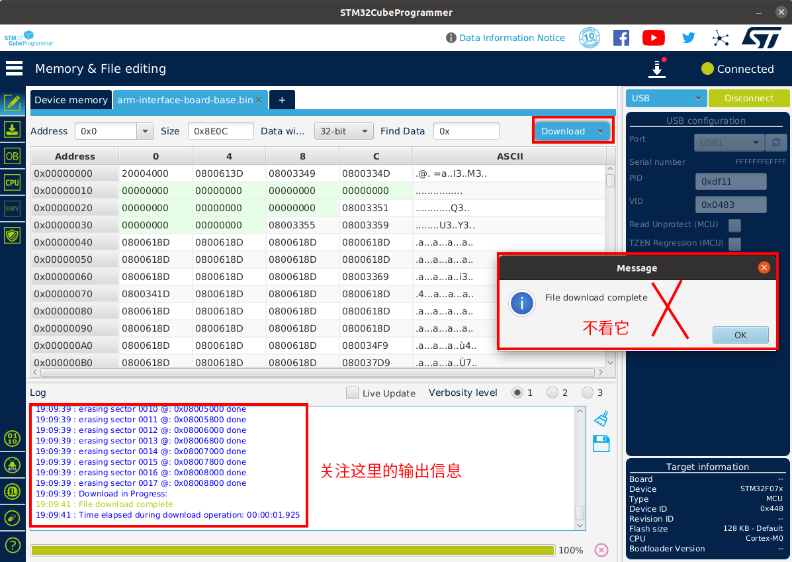
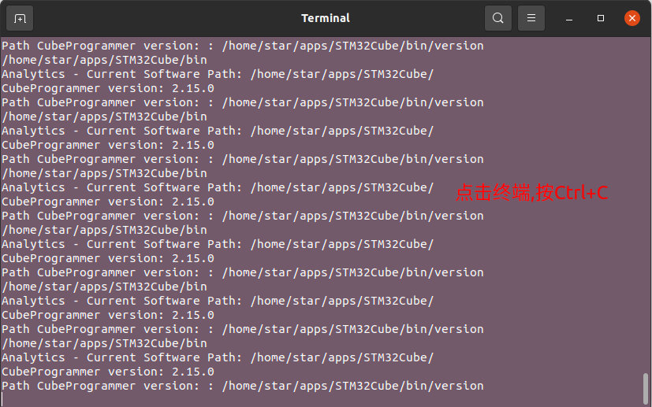

# 机械臂底座接口板固件烧录

## 1.下载固件

[arm-interface-board-base](https://empty)

## 2.安装 CubeProgrammer

[CubeProgrammer 官网下载链接](https://www.st.com/zh/development-tools/stm32cubeprog.html?dl=redirect)

按照以下步骤下载软件

由于开发平台是ubuntu, 选择linux版本, 点击`选择版本`, 选择`2.15`版本(2.16已知有bug), 再依次点击`接受`, `作为访客下载`

解压软件包,在软件包解压目录打开终端, 运行以下命令
```bash
./SetupSTM32CubeProgrammer-2.15.0.linux
```
在弹出的窗口中依次点击`Next`, `Next`, 选择`I accept the terms of the licesse agreements`, `Next`

此处可以自定义安装路径, 设置好路径之后, 选中并复制路径, 打开一个终端,依次输入以下命令:
```
export CUBEPATH='复制的路径'
echo "alias stm32cube='sudo $CUBEPATH/bin/STM32CubeProgrammer'" >> ~/.bashrc
```
例如:

关闭终端

选择好路径之后, 点击`Next`, 如果路径不存在将会弹出窗口提示目标文件夹将会被创建, 点击`OK`即可
接下来勾选`I have read and understood the  and ST Terms of Use.`, 再一直点击`Next`直到安装结束, `Done`.


## 3.烧录程序
使用杜邦线/牙签等细长工具压下CONFIG按键，确保此时底座接口板处于断电状态（POWER和USB线都没连）

单独用typec数据线连接USB-2口和电脑

打开终端, 输入以下命令打开烧录软件

```bash
stm32cude
```

通信方式选中USB, 点击刷新(如果刷新不出来请检查config建是否按下), 出现USB1即表示已经成功检测到底座板, 点击`Connect`连接底座板

然后再按照下图所示步骤, 找到固件下载目录, 选中固件, 点击`open`加载固件

准备好之后点击`Download`,等待10s左右,如果输出以下信息则表示烧录成功,点击`OK`

至此, 底座板固件升级已经完成, `如果要关闭软件, 不要直接点叉`, 请点击用来打开软件的终端, 按Ctrl+C关闭软件(或者直接关闭该终端)
