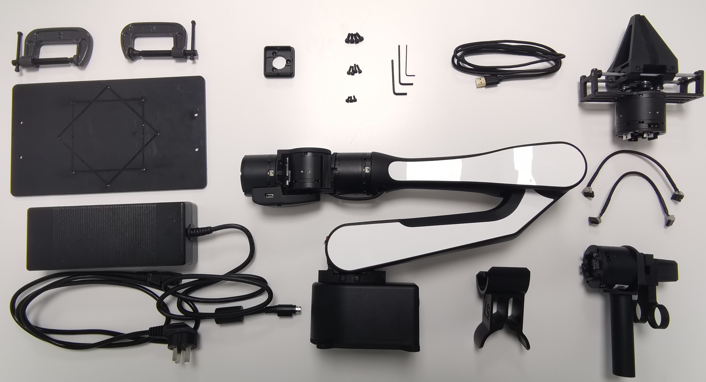
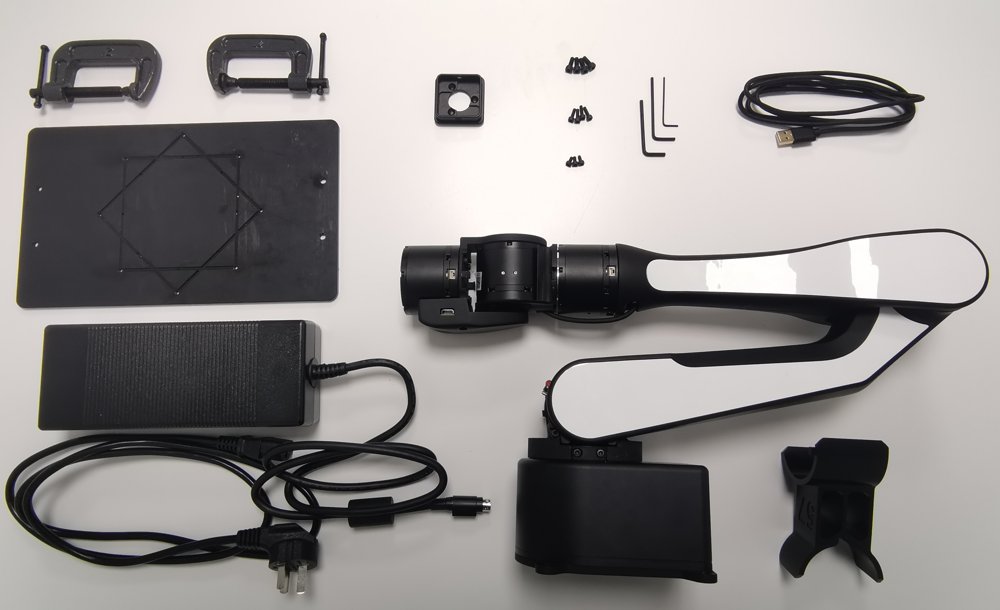
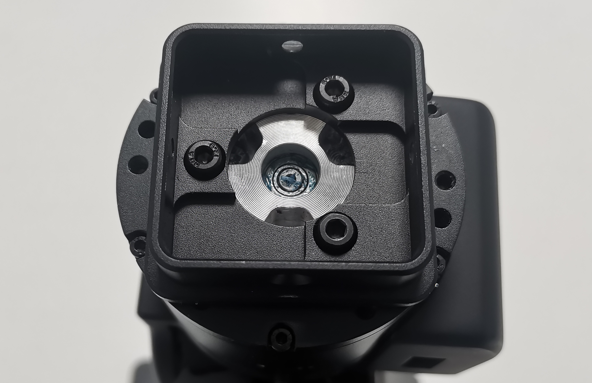
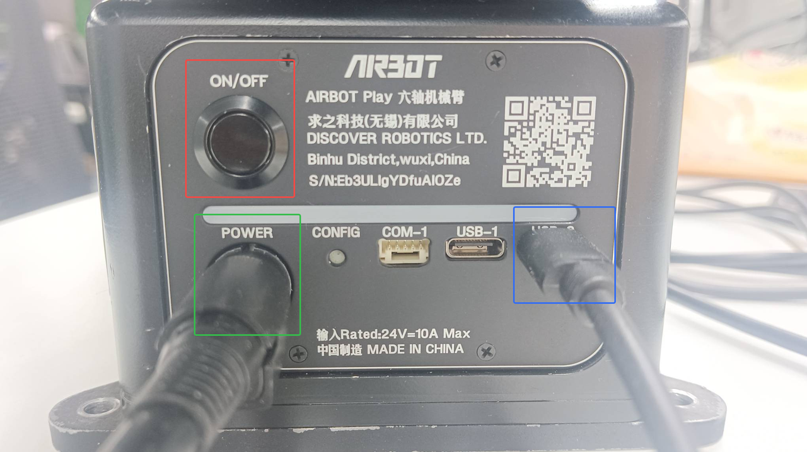
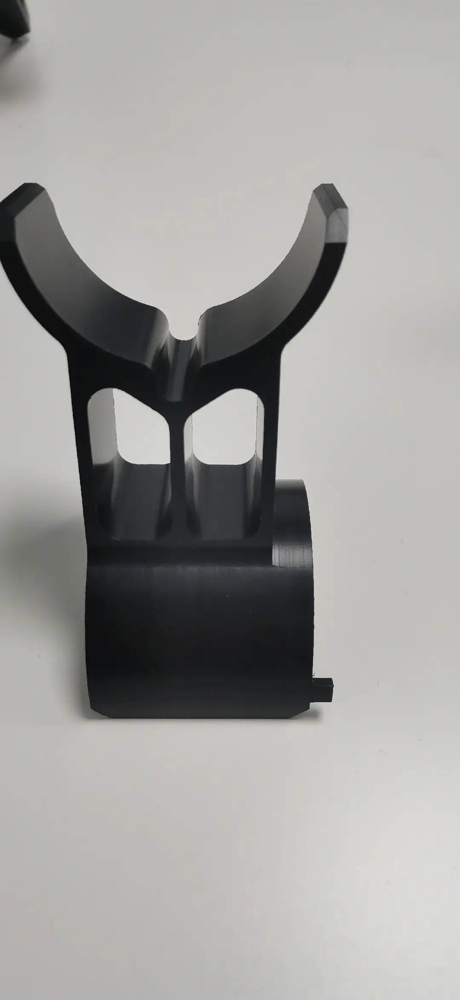
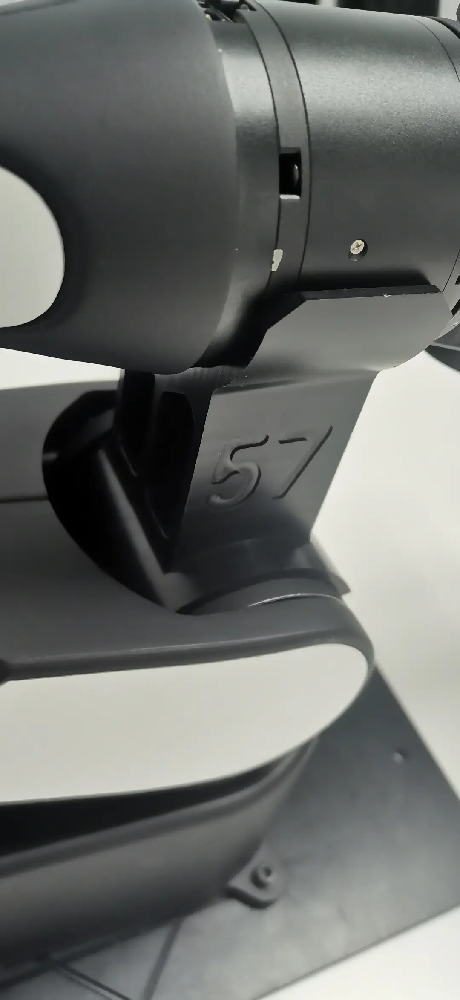

---
hide:
  - navigation
---

# AIRBOT Play 用户手册   
 
## 机械臂清单  
 

| 序号  |        名称        | 单位  | 数量  |       备注       |
| :---: | :----------------: | :---: | :---: | :--------------: |
|   1   | AIRBOT Play 机械臂 |   1   |  台   |                  |
|   2   |      安装底板      |   1   |  个   |                  |
|   3   |     固定C型夹      |   2   |  个   |                  |
|   4   |     末端连接件     |   1   |  个   |                  |
|   5   |     USB 数据线     |   1   |  根   |                  |
|   6   |     电源适配器     |   1   |  个   |                  |
|   7   |       电源线       |   1   |  根   |                  |
|   8   |        螺丝        |   1   |  包   |    螺丝M3、M4    |
|   9   |      L 型扳手      |   1   |  套   |    M2、M3、M4    |
|  10   |      标零工具      |   1   |  个   |                  |
|  11   |       示教器       |   1   |  套   | 含连接线【选配】 |
|  12   |        夹爪        |   1   |  套   | 含连接线【选配】 |

**表1.1 清单表格**

---

 
**图1.1 清单图片（含选配套件）**
 

## 机械臂安装说明
### 单臂安装  

  

**图2.1 单臂清单图**

#### 安装底板 

取出臂、底板、m4螺丝*4、L型M4扳手，根据场景按需要的角度（正安装 / 斜 45 度安装）将臂固定在底板上，如下图所示： 

 
**图2.1 底板**

 
**图2.2 正安装方式**

 
**图2.3 斜45度安装方式**

#### 固定底板

在使用机械臂之前，需要将底板固定在稳固的底座上。

随机械臂附带的 **C 型夹固定方式**可用于将底板固定在桌沿，如下图所示：

  

**图2.4 底板C型夹固定方式**

!!! warning "注意："
    安装后必须确定机械臂处于开阔空间，以防机械臂在运动时碰撞到周围的人或物品。
   

底板也可通过两侧的 M5 通孔 * 4 安装固定在需要的设备上，底板的孔位图：  


**图2.5 底板孔位尺寸图**

#### 安装末端连接件
取出末端连接件、M3 螺丝 * 3、L 型扳手如下图：  


**图2.6 末端连接件及配件**

将末端连接件三个固定销与末端电机安装并用 M3 螺丝 * 3 固定，如下图：  

  
**图2.7 末端连接件固定销*3位置图**

  
**图2.8 末端连接件固定完成图**

### 安装夹爪 【选配套件】   
取出夹爪、M4螺丝 * 4，如下为夹爪与连接件固定位，将该放入末端连接件中，固定安装。  

  
**图2.9 夹爪电机连接固定位置图**

  
**图2.10 夹爪螺丝位置图**
取出夹爪配套的连接线


**图2.11 夹爪连接线**

找到如下图所示电源插口安装，

!!! warning "注意："
    避免强行拉拽线，造成接触不良，安装或取下时拔插两个端口处。


**图2.12 夹爪安装插口图**

  
**图2.13 夹爪安装实物图**

### 安装示教器 【选配套件】   

取出示教器、M4螺丝*4，如下为示教器与连接件固定位，将该放入末端连接件中，固定安装。  

  
**图2.14 示教器电机连接固定位置图**


**图2.15 示教器螺丝位置图**

取出示教器配套的连接线


**图2.16 示教器连接线**

找到如下图所示电源插口安装

!!! warning "注意："
    避免强行拉拽线，造成接触不良，安装或取下时拔插两个端口处。


**图2.17 示教器安装插口图**


**图2.18 示教器安装实物图**

## 机械臂使用说明  
### 底座面板

  
**图3.1 机械臂面板**


* 红框部分是开机键，长按3s左右待指示灯条黄色灯珠依次全部亮起，等待黄灯全亮变成白灯全亮后完成开机
* 红框部分是关机键，长按3s左右待指示灯条黄色灯珠依次全部熄灭，完成关机
* 绿框部分是电源接口
* 蓝框部分是通信接口

!!! info "USB"
    USB-1 (TypeC) 接口用于连接相机，用于视觉传感器数据传输。

    USB-2 (TypeC) 接口用于连接上位机，用于数据传输和控制。

### 开机与标零
#### 准备电脑

在 Ubuntu 20.04 系统安装最新的机械臂软件包，并配置好环境，至少安装 [`airbot_play`](#) 与 [`airbot_tools`]() 两个软件包

#### 标零  
首先使用数据线将电脑与机械臂 USB-2 连接，长按电源键 3s 左右待指示灯条黄色灯珠依次全部亮起，等待黄灯全亮变成白灯全亮后完成开机。

运行 `airbot_set_zero` 命令，按代码提示，将标零工具放入 2 号关节处。标零工具需要紧密贴合 2 号关节电机，竖直向上放置，将机械臂固定在零位。


**图3.2 标零工具卡口**


**图3.3 标零工具固定位置图**


**图3.4 标零机械臂实物图**

放置完成后按回车，等待机械臂完成标零；标零完成后可将机械臂小臂抬起，拿出标零工具，随后再次按回车，等待标零结束。


### 键盘控制  

运行键盘控制工具，机械臂进入受控状态：

```shell
airbot_play_node
```

在该状态下：

* 点按键盘 `W` / `A` / `S` / `D` / `Q` / `E` 控制机械臂前后左右上下移动
* 点按键盘 `1` - `0` 控制单个关节顺逆时针旋转
* `[` 与 `]` 控制夹爪开合
* 长按末端按键进入重力补偿模式。在该模式下机械臂可被自由拖动；在该模式下短按底座按键开始 / 停止录制动作
* 双击末端按键进入重放待机模式。在该模式下，短按底座按键开始重放动作
* `Ctrl+C` 或 `Z` 退出程序

其他控制工具详见 [AIRBOT Tools](#)

## FAQ  
??? question "AIRBOT Play 机械臂相比于同类型的协作臂的优势是什么？"
    * 体积小，没有外置控制柜，方便集成
    * 重量轻，自重仅3.5kg，可用于各种小型移动平台（四足、轮足、无人机等）。
    * AI+，兼容ALOHA、Mobile ALOHA、 RT-X、VoxPoser等具身智能前沿工作，借助大模型理解自然语言指令，支持一键场景扫描功能，配合高保真仿真器，提高机械臂智能程度。  

??? question "AIRBOT Play 机械臂的供电电压及电流是多少？"
    AIRBOT Play的供电电压范围是直流 24V，最大功率 240W。供电设备最好能提供瞬间最大10A的电流，以供机械臂在各种工况下使用。
    可以使用配件中的电源适配器接入市电使用，也可以通过提供的电源线连接电池或移动电源供电。
    电源适配器的插头防呆，正确插法见下图：

    

    **图4.1 电源连接图**


??? question "AIRBOT Play机械臂的末端可以接哪些执行器？"
    如果是 CAN 接口的末端执行器（如求之自研夹爪 AIRBOT Gripper），可以使用6号关节处的接口；该接口输出电压 24V，额定输出电流 1.15A。
    如果是 RS485 接口的末端执行器，可以使用末端板的 RS485 接口，输出电压 5V / 7V / 24V，额定输出电流 1.15A。  

??? question "AIRBOT Play机械臂的末端可以接哪些相机？"
    机械臂末端板的 USB Type-C 接口可以直接连相机，然后通过机械臂底座板的 USB-1 (TypeC) 接口连接上位机，实现相机的内部走线数据透传。
    已测试可用的相机：舜宇、银牛、V4L2 相机；支持相机种类会持续更新。  

??? question "AIRBOT Play机械臂的主控处理器是什么？"
    目前版本的 AIRBOT Play 机械臂由上位机控制，即将发布的AIRBOT Play **Pro** 将采用内置 X5 处理器。

??? question "目前支持的仿真平台有哪些？"
    目前支持 Isaac Sim、Gazebo 等仿真平台（持续添加中）。

??? question "夹爪的夹取算法包含哪些？是否可以提供？"
    包括 Graspnet / Catgrasp 等模块化抓取算法，以及 voxposer 等端到端规划抓取算法。
    我们可以根据需求，提供相关代码包。

??? question "多模态感知包含哪些？是否可以提供？"
    多模态包括末端视觉、末端触觉、环境语音、场景SOP说明等，多模态感知融合多种环境信息进行长程任务执行。
    我们可以根据需求，提供相关代码包。