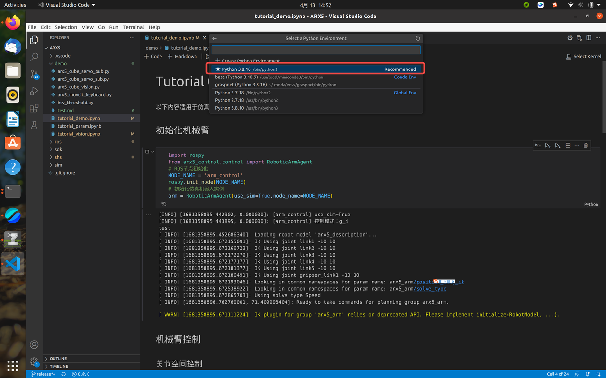
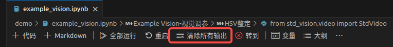
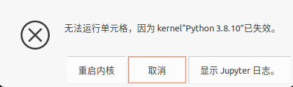
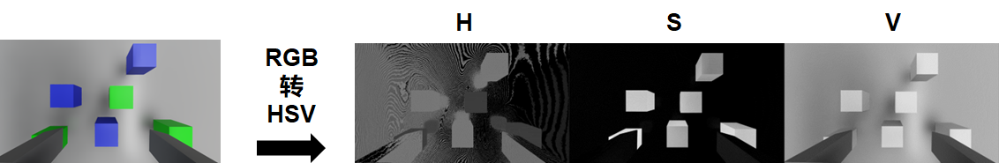
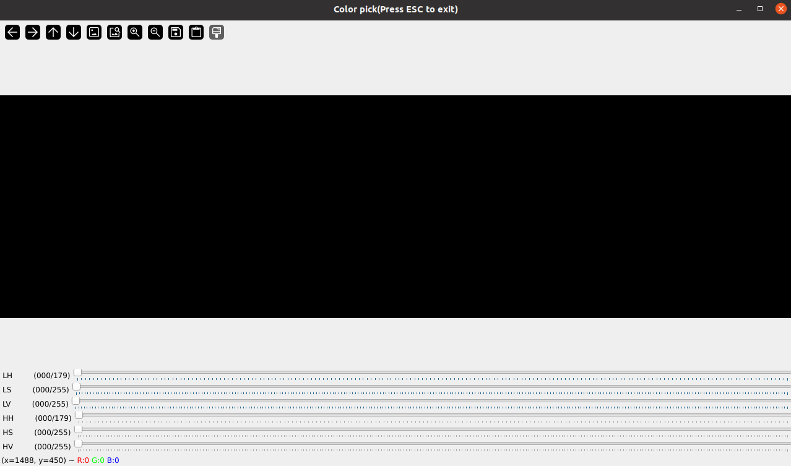
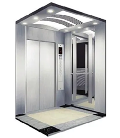

# 预备知识

* Linux的基本概念的理解与命令行操作。

# 实验设备

* 一台已经配置好软件环境或装有虚拟机/Docker环境的主机。

* 鼠标、键盘等外设。

# 实验目标

* 学习基本的Linux命令行操作方式。

* 了解通过VsCode和JupyterNotebook进行Python脚本的运行。

* 体验仿真中的机械臂控制，以及与仿真的交互。

* 仿真视觉识别与控制的参数调试的基本认知与实践。

# 效果展示

# 快速体验

## 虚拟机使用

* 参考该链接：[ 首页](https://l02hj41pak.feishu.cn/wiki/Kpklw15X8ilaqMkhj7WchnmUnhd)，中的下载安装、基本使用、系统导入、注意事项四部分。

* 虚拟机系统登陆密码为`123`。

## 基于VsCode与Jupyter Notebook的仿真机械臂控制

进入airbot\_play\_blocks\_building文件夹中（以实际放置的目录为准），然后鼠标右键菜单中打开终端：


首先在终端中（称为终端1）执行如下命令**启动仿真**：

```bash
roslaunch airbot_play_gazebo demo.launch use_xacro:=true start_moveit:=true world_pose:="-x 0 -y -0.2 -z 1.08 -R 0 -P 0 -Y 1.57" image_view:=true
```

一段时间后可以看到**仿真界面出现**：


同时会弹出一个相机图像的窗口：


然后新建一个终端（可以点击之前打开的终端的**左上角的加号**，这样可以保证两个中终端当前在同一目录下）：


可以看到两个终端，终端的**标签上可以看到当前所在目录为airbot\_play\_blocks\_building（注：后续若未说明“任意终端”，则均默认为在此目录下的终端，并且不是VsCode）**：


然后在新打开的终端（称为终端2）中执行如下命令通过**VsCode**打开airbot\_play\_blocks\_building文件夹目录：

然后可以看到如下界面：


在左侧资源管理器中左键点击打开**demo文件夹**中的**example\_control.ipynb**：


然后可以点击第一个代码块，代码块将高亮显示，然后按`Ctrl+Enter(回车)`执行该代码块（或点击代码块左侧的三角形运行按钮），以初始化ROS节点和机械臂对象。**注意：按键按下后，代码块有可能不是立刻执行，而是VsCode上方弹出了提示，如下图，点击选择红框所示选项（Python Environment）即可：**


还可能会弹出如下提示，点击选择红框中所示选项（**带有/bin/python3字样**）即可：



还可能会有如下提示，这是因为第一次使用Jupyter Notebook缺少一些必要的内核包：


点击最右侧的**install**按钮安装，会看到VsCode右下方正在安装一些东西：


等待安装完成后，代码块将成功执行，可以从输出的信息中判断初始化成功（出现下图中的黄色的WARN和红色的ERROR是正常现象）：


此时仿真中的机械臂没有什么反应是正常的，因为我们还没有进行控制。下面可以**按照前一步的做法依次执行后续代码块（即点击代码块后按"Ctrl+回车"）**，每个代码块运行后，代码块下方会输出相应的信息，仿真中的机械臂都会执行相应的动作。

可以尝试修改代码块中的参数然后重新执行代码块查看不同的运行效果，但需**注意**：

1. 不要重复执行第一个代码块，即不要重复进行初始化操作；

2. 参数的修改要在合理的范围内，否则动作将无法正确执行；

3. 执行某个代码块后等代码块下方出现“√”表示执行完毕，然后再运行其它代码块。

4. 机械臂运动出现问题后，可以执行预置位姿控制让机械臂回到合适位置。

体验完成后，**结束终端进程**只需要依次点开刚才打开的**终端1和2中按`Ctrl+C`**即可。

## 仿真交互

点击仿真窗口工具栏左侧第二个按钮（如下图左上角红框所示）可进入平移模式，此时点击仿真界面中的物块（注意不要点到桌子上），物块的坐标系将显示，可以尝试拖动物块的某个轴使物块发生移动：


也可以点击旁边的旋转工具（如下图红框所示），此时物块上的直角坐标系变成了环形，尝试用鼠标转动环形，物块将被旋转：


## 清除进程

使用Jupyter Notebook后可能会存留一些Python进程影响占用电脑的资源，积累多了会造成电脑非常卡顿。为了快速关闭他们，可以**首先手动关闭运行中的仿真（建议）**，然后在AIRBOT\_Play所在终端中执行如下命令（需要输入密码）：

这样进程就被清理了。

**不过，此时VsCode会弹出内核关闭的提示，例如**：


这时点击“重启”按钮**重启内核**即可：


输出的错误信息等可以通过**“清除所有输出”**按钮来清除，以使界面简洁：



若没有点击重启，则在尝试**运行代码块时**会弹出如下错误：



选择**“重启内核”**即可正常使用。

# Pick\&Place调参

## 视觉调参

### 课程回顾

之前课程中有讲解“色彩空间”的知识：


在数字图像处理进行颜色分割时，一般不采用RGB色彩空间，而是使用HSV色彩空间。HSV色彩空间中，每一种颜色都是由[色相](https://baike.baidu.com/item/%E8%89%B2%E7%9B%B8?fromModule=lemma_inlink)（Hue，简H），[饱和度](https://baike.baidu.com/item/%E9%A5%B1%E5%92%8C%E5%BA%A6?fromModule=lemma_inlink)（Saturation，简S）和色明度（Value，简V）所表示的，换句话说这个模型中颜色的参数分别是：色调（H），饱和度（S），亮度（V）。



一幅图像可以据此被分成三个“通道”，分别代表H、S、V三个颜色分量的取值。不同颜色效果的物体这三个分量的取值范围是不同的，因而可以据此实现图像中不同颜色物体的分割。


视觉调参的目的，就是要找到仿真中不同颜色物体的HSV阈值范围，从而将目标物体与其它物体分割开来。

### 动手实践

**首先在终端1中执行命令开启仿真，**然后执行如下命令：

此时机械臂会移动到识别的位置。将看到弹出如下窗口（在运行环境下默认窗口可能很大遮挡了滑块下面的视窗，这时拖动调整大小即可）：



其中6个滑条分别对应了视觉阈值的6个参数，尝试拖动滑条，以实现选中3个蓝色或绿色物块，以绿色物块为例，若参数调整合适，将看到如下显示，这样就将绿色物块提取出来了：


可以尝试在仿真中拖动物块到不同的位置以确保物块在不同位置都能被正确提取出来。

若调整完毕，可以**手动记录**下当前的参数（LH\LS\LV\HH\HS\HV)，然后调整滑条再确定蓝色物块的参数；或者可以按键盘上的**ESC键退出**该界面，然后可以在**VsCode中看到代码块下面输出了**调整后得到的参数信息，可以**直接复制**到别处（比如**添加到代码块的注释中**）以备后续使用，然后再次以同样的方式运行该代码块以完成对另一个颜色物块参数的确定。

综上，我们得到了蓝色物块和绿色物块的视觉参数信息。

下面我们将之前记录的这两组参数**添加到仿真配置文件**中（将用于后续控制调参），方法是在configs/vision文件夹中打开文件gazebo.json：


其中前两行中每一行中包括6个参数，分别是该色块的6个颜色阈值（从左到右依次对应滑条界面中从上到下的值）。现在，将之前记录的各个参数对应地填写到上述文件中按Ctrl+S保存即可。

## 控制调参

### 课程回顾

之前课程中有讲解“闭环控制”的知识：




其中关键是控制器的设计，常用的是PID控制器：


在前述实验中，机械臂之所以能够到达给定的目标位置，本质上是各个关节电机内部PID控制器作用的结果。而在机械臂跟踪平面上的物块时，我们不需关注机械臂自身控制器的实现，只需考虑如何根据图像中物体当前位置与期望位置的像素偏差，控制机械臂末端的移动，以使偏差近似为0。结合前面实验中对机械臂的控制过程，我们只需要将图像中x，y方向的像素偏差量转换为机械臂工作空间中x，y轴的移动增量，控制机械臂进行增量式移动，便可实现机械臂对目标物块的自动跟踪。x和y方向的转换关系是一样的，表现为将正方形物块放到图像中央看到的仍然是正方形。

### 动手实践

视觉调参结束后，可以进行控制调参。首先`Ctrl+C`**退出之前启动的终端1、2进程**以避免之前运行程序的干扰，然后终端1中再次执行如下命令**启动仿真**：

然后在终端2中执行如下命令**启动Pick阶段的控制调参程序**：

此时机械臂不会进行移动，因为还没有进行控制参数配置。

新建一个终端（称为终端3），执行如下命令启动视觉识别命令：

再新建一个终端（称为终端4），然后执行如下命令设置参数为20.25：

可以看到机械臂开始跟踪最近的第一个颜色的物块（不会夹取），但是跟踪效果不是很好，这时可以根据运行效果**重新修改参数**执行上述命令，机械臂的控制效果将动态调整。如果机械臂跑飞无法看到物块（或者机械臂尚未移动到物块上方但长时间静止不动），可以按`Ctrl+C`退出终端1、2、3，然后**重新在3个终端中执行上述4个命令**（**Tips：点击终端，然后按键盘的“↑”键可以查看终端中执行过的历史命令记录**，可以看到终端输入框中出现了之前执行的命令，然后按回车键即可执行；**只需测试第1个颜色的物块的跟踪效果**即可，因为控制参数与物块颜色变化无关）。

参数设置好后，机械臂可以稳定在物块的上方，这时可以在仿真中点击物块然后拖动（注意不要点到桌子拖动桌子），以进一步查看跟踪效果。

然后可以调节Place阶段的参数。关闭终端2、3但**保留终端1（即不要关闭仿真）**，然后与之前类似，执行如下命令（第一个命令的参数由之前的0调整为1）：

然后机械臂将先移动到初始位置，后将跟踪并抓起物块，最终在Place阶段的位置停靠。接下来可以进行place阶段控制参数的设置：

可以看到机械臂开始移动尝试对齐下方物块（不会释放），效果有待调整。

## 完整运行

`Ctrl+C`退出终端1、2，然后在终端1中执行命令启动仿真，待仿真启动完成后，在终端2中执行如下命令（其中两个参数修改为自己刚才调试的两个参数），以在调试后的视觉和控制参数基础上**运行完整搭建流程**，观察效果：

若效果不好（与效果展示中差距较大），则退出所有终端，然后重新进行3.3.2和3.3.3的相关步骤。

